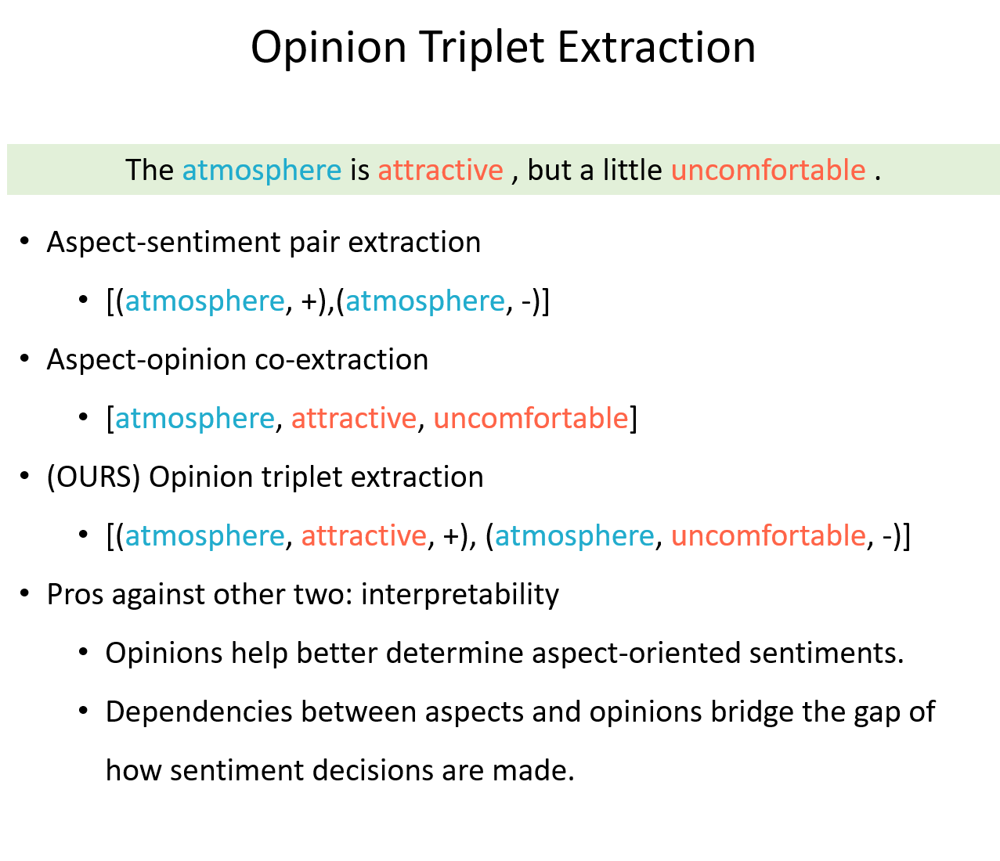

# Generative Approach for Opinion Triplet Extraction

> What is extraction? Is it about labelling each inputs token to see which should be extracted? Here we use different approach to extracting information from text i.e, by generating text that represent the information need to be extracted after the model had read the entire input text.

This repository is my final year undergraduate project on Institut Teknologi Bandung, supervised by Dr. Masayu Leylia Khodra, ST., MT. It contains the unpolished source codes (.py on /src and .ipynb on /notebooks), book (Indonesian), and paper (English).

- Book title:
  [Pendekatan Generatif Berbasis Model Bahasa Pralatih Untuk Ekstraksi Triplet Opini]()

- Paper title (Arxiv):
  [Text Generation for Opinion Triplet Extraction]()

## Abstract

Previous research on Aspect Sentiment Triplet Extraction (ASTE) for Indonesian reviews in the hotel domain has been conducted in a discriminative manner using a sequence labeling approach. However, the triplet opinion extracted by that research is limited to only explicit triplet opinion, while neglecting the triplet opinion that contains implicit aspects. In this work, we propose a model that can perform opinion triplet extraction with explicit and implicit aspects based on the seq2seq approach.

Based on Zhang et al. (2021) work, we build a system that can extract opinion triplets by using pre-trained language models that have been fine-tuned on a dataset with the modified label following the extraction-style annotation paradigm. The generated text can be extracted to get the opinion triplets. By transforming ASTE into a text generation problem with the help of a pre-trained language model (IndoT5), we manage to achieve a significant improvement of 4% on the F1 score compared to the result from our previous study.

## Task

An overview of the task opinion triplet extraction (OTE) is given below

> ps: Image from Zhang et al., (2020) github. [Link](https://github.com/GeneZC/OTE-MTL)

OTE is solving the same task proposed in https://arxiv.org/abs/1911.01616. Our work focuses on extracting (aspect term, opinion term, sentiment) opinion triplets (OTs) with addition of opinion triplets with implicit aspect. This is done by aggregating opinion term with no explicit aspects with a special aspect (`NULL`) to merge it into triplet opinions with implicit aspect.

## Dataset

More details of dataset on the book and paper.
[Source](https://drive.google.com/drive/folders/1k1gIu56Y6zS-qmypq5hzecCqAiWrTR-a?usp=sharing)
For more information, v1 dataset is obtained from Wirawan & Khodra, 2021 work for Indonesian hotel review. v2 dataset is v1 dataset with minor fix for some label, while v3 dataset is v2 + triplet opinions with implicit aspect.

## Requirement

- Python 3.7.2
- Pytorch 1.9.1
- Transformers 4.12.5

## Changelog

- June. 25th, 2021. Initial update and release of unpolished source code for this work, along with the dataset used (v2 and v3).

## Contact

For any issues or suggestions about this work, don't hesitate to create an issue or directly contact me via this [email](13518138@std.stei.itb.ac.id). Also, please ⭐ this repo so other can see it too!
