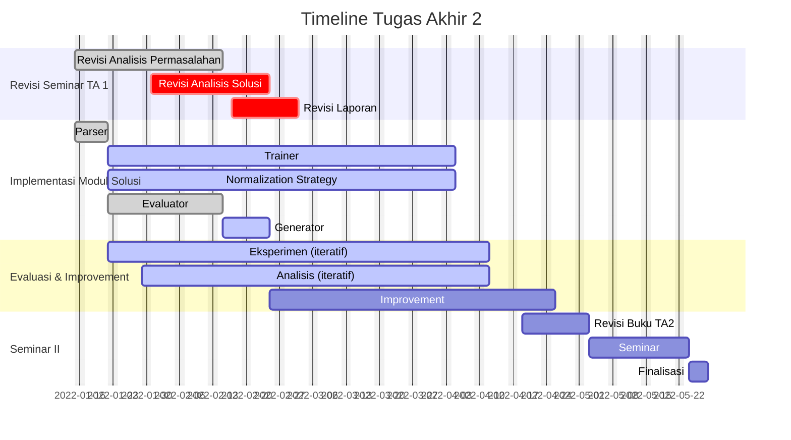

# Generative Aspect Sentiment Triplet Extraction 

Timeline:

```mermaid
gantt
    title Timeline Tugas Akhir 2
    dateFormat  YYYY-MM-DD
    excludes    weekends

    section Revisi Seminar TA 1
    Revisi Analisis Permasalahan    : done, sec1, 2022-01-15, 2022-02-15 
    Revisi Analisis Solusi          : crit, sec2, 2022-01-31, 2022-02-25
    Revisi Laporan                  : crit, sec3, 2022-02-17, 2022-03-03

    section Implementasi Modul Solusi
    Parser                          : done, impl1, 2022-01-15, 2022-01-22
    Trainer                         : active, impl2, after impl1, 2022-04-05
    Normalization Strategy          : active, impl3, after impl1, 2022-04-05
    Evaluator                       : done,impl4, after impl1, 2022-02-15
    Generator                       : active, impl5, after impl4, 2022-02-25  

    section Evaluasi & Improvement
    Eksperimen (iteratif)           : active, exp1, 2022-01-22, 2022-04-12
    Analisis (iteratif)           : active, exp2, 2022-01-29, 2022-04-12
    Improvement : exp3, 2022-02-25, 2022-04-26

    section Seminar II
    Revisi Buku TA2                 : prep1, 2022-04-19, 2022-05-03
    Seminar                         : prep2, 2022-05-03, 2022-05-24
    Finalisasi                      : prep3, 2022-05-24, 2022-05-28
```